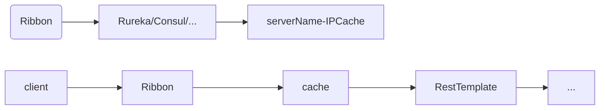

# 服务间通信

## RestTemplate

### 概述

Spring框架为我们提供了RestTemplate类，简化了http服务的通信方式，统一了RestFul风格，封装了http链接，我需要一个url及返回值即可调用其他服务。

### 实践

创建两个SpringBoot项目，注册到服务注册中心consul上，快速开发Controller

服务1：

* 端口号8888

```java
@Controller
public class TestController {:
    @GetMapping
    @ResponseBody
    public String test() {
        return "I am restTemplate1";
    }
}
```

服务2：

* 端口号为9999
* 新建RestTemplate对象，使用对象的getForObject方法，参数为url和返回值的类型即可调用服务1中的方法

```java
@Controller
public class TestController {
    @GetMapping
    @ResponseBody
    public String test() {
        RestTemplate restTemplate = new RestTemplate();
        String result = restTemplate.getForObject("http://localhost:8888", String.class);
        return result;
    }
}
```

### 常用方法

#### GET

```java
// 请求地址、返回值类型、请求参数（一一对应）
public T getForObject(String url, Class responseType, Object… uriVariables) {...}

public T getForObject(String url, Class responseType, Map<String, ?> uriVariables) {...}

public T getForObject(URI url, Class responseType) {...}

public ResponseEntity getForEntity(String url, Class responseType, Object… uriVariables) {...}

public ResponseEntity getForEntity(String url, Class responseType, Map<String, ?> uriVariables) {...}

public ResponseEntity getForEntity(URI url, Class responseType) {...}

//getForEntity的返回值含完整的信息，而getForObject只有响应体

// 状态信息
HttpStatus statusCode = entity.getStatusCode();
// 状态码
int statusCodeValue = entity.getStatusCodeValue();
// 响应头
HttpHeaders headers = entity.getHeaders();
// 响应体
CommonResult body = entity.getBody();
```

#### POST

post方法比get方法多了个request参数，也有postForEntity

```java
//返回参数为uri，为重定向的uri，表示新资源的位置
public <T> T postForObject(String url, @Nullable Object request, Class<T> responseType, Object... uriVariables) {...}

public <T> T postForObject(String url, @Nullable Object request, Class<T> responseType, Map<String, ?> uriVariables) {...}

public <T> T postForObject(URI url, @Nullable Object request, Class<T> responseType) {...}

//关于request
//请求头设置,x-www-form-urlencoded格式的数据
HttpHeaders headers = new HttpHeaders();
headers.setContentType(MediaType.APPLICATION_FORM_URLENCODED);

//提交参数设置
MultiValueMap<String, String> map = new LinkedMultiValueMap<>();
map.add("title", "zimug 发布文章第二篇");
map.add("body", "zimug 发布文章第二篇 测试内容");

//组装请求体
HttpEntity<MultiValueMap<String, String>> request =
    new HttpEntity<MultiValueMap<String, String>>(map, headers);

//发送post请求，并打印结果，以String类型接收响应结果JSON字符串
String result = restTemplate.postForObject(url, request, String.class);
```

#### PUT、Patch

和post差不多，没有返回值，不赘述

#### DELETE

```java
//表删除、无返回值
public void delete(String url, Object… uriVariables) {...}

public void delete(String url, Map<String, ?> uriVariables) {...}

public void delete(URI url) {...}
```

#### optionsForAllow

```java
//参数和delete一致，返回可执行的方法的set集合
public Set optionsForAllow(...) {...}
```

#### exchange

exchange方法提供统一的方法模板进行请求

```java
public ResponseEntity exchange(String url, HttpMethod method,@Nullable HttpEntity<?> requestEntity, Class responseType, Object… uriVariables) {...}

public ResponseEntity exchange(String url, HttpMethod method,@Nullable HttpEntity<?> requestEntity, Class responseType ,Map<String, ?> uriVariables ) {...}

public ResponseEntity exchange(URI url, HttpMethod method, @Nullable HttpEntity<?> requestEntity, Class responseType) {...}

public ResponseEntity exchange(String url, HttpMethod method, @Nullable HttpEntity<?> requestEntity, ParameterizedTypeReference responseType, Object… uriVariables) {...}

public ResponseEntity exchange(String url, HttpMethod method, @Nullable HttpEntity<?> requestEntity, ParameterizedTypeReference responseType, Map<String, ?> uriVariables) {...}

public ResponseEntity exchange(URI url, HttpMethod method, @Nullable HttpEntity<?> requestEntity, ParameterizedTypeReference responseType) {...}

public ResponseEntity exchange(RequestEntity<?> requestEntity, ParameterizedTypeReference responseType) {...}

public ResponseEntity exchange(RequestEntity<?> requestEntity, Class responseType) {...}

// HttpMethod：GET, HEAD, POST, PUT, PATCH, DELETE, OPTIONS, TRACE
// HttpEntity：分请求头（类型为MultiValueMap）、请求体（类型为 T ）
```


## Ribbon

### 概述

使用RestTemplate时，调用其他服务的时候，请求url被写死在方法中，**无法实现负载均衡**，且如果被调用服务的服务路径被改变时，**维护会变得很麻烦**。

Spring Cloud Ribbon是一个基于HTTP和TCP的**客户端负载均衡工具**，它基于Netflix Ribbon实现。通过Spring Cloud的封装，可以让我们轻松地将面向服务的REST模版请求自动转换成客户端负载均衡的服务调用。

**注：Ribbon只是利用服务注册中心实现负载均衡，发请求的还是RestTemplate！**



### 实践

1. 复用RestTemplate的两个服务，再复制启动一个SpringBoot项目，端口为11111，服务名设置为与9999相同（代表同一类服务）

2. 引入依赖，注：**eureka和consul已经集成了ribbon组件，无需手动引入**

   ```xml
   <dependency>
     <groupId>org.springframework.cloud</groupId>
     <artifactId>spring-cloud-starter-netflix-ribbon</artifactId>
   </dependency>
   ```

3. 两种类型的对象，注入：DiscoveryClient、LoadBalancerClient

   ```java
   @Autowired
   DiscoveryClient discoveryClient;
   
   @Autowired
   LoadBalancerClient loadBalancerClient;
   ```

4. DiscoveryClient获取实例列表，实际调用策略是我们自己定义；而LoadBalancerClient有负载均衡策略（默认轮询），直接获取一个实例

   ```java
   public void test() {
       List<ServiceInstance> list = discoveryClient.getInstances("RESTTEMPLATE2");
       list.forEach(service -> {
           System.out.println(service.getHost() + ":" + service.getPort() + ", " + service.getUri());
       });
       
       ServiceInstance instance = loadBalancerClient.choose("RESTTEMPLATE2");
       System.out.println(instance.getHost() + ":" + instance.getPort() + ", " + instance.getUri());
   }
   ```

   

5. 5

6. 6

7. 7

