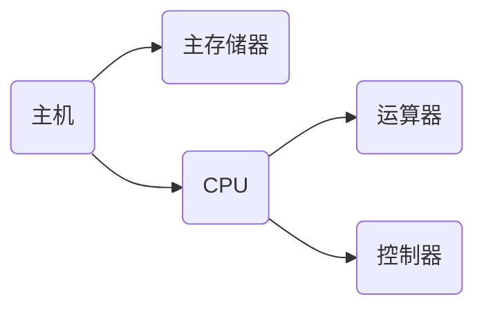

# 计算机组成原理与体系结构

## 数据的表示

### 进制转换

#### R进制转十进制

​	R进制转十进制使用`按权展开法`，其具体操作方式为∶将R进制数的每一位数值用Rk形式表示，即幂的底数是R，指数为k ，k与该位和小数点之间的距离有关。当该位位于小数点左边，k值是该位和小数点之间数码的个数，而当该位位于小数点右边，k值是负值，其绝对值是该位和小数点之间数码的个数加1。

* 如七进制：

  ```
  604.01 = 6 * 7^2 + 0 * 7^1 + 4 * 7^0 + 0 * 7^-1 + 1 * 7^-2
  ```

#### 十进制转R进制

​	十进制转R进制使用短除法。依次除以R，取余数并反转。

* 如转二进制：

  ```
  2 | 94		余 0
  2 | 47		余 1
  2 | 23		余 1
  2 | 11		余 1
  2 | 5		余 1
  2 | 2		余 0
     1		余 1
  得到的结果即为：1011110
  ```

#### 二进制快速转八进制与十六进制

​	从低位开始，每3位二进制转为一个八进制位，每4位二进制位转为一个十六进制，位数不足高位补0

* 如

  ```
     10001110
  ->  2 1 6
  ->   8  E
  ```


### 常见的编码

#### 原码

1. 转换为二进制，位数不足8位则往左边补0，最高位为符号为，0表示正数，1表示负数
2. 不能在机器中直接加减

#### 反码

1. 正数和原码完全一样
2. 负数则是在原码基础上符号位不动，其余位按位取反
3. 反码计算后，仍要转换为原码才能得到结果

#### 补码

1. 正数和原码一样，负数则再反码的基础上加1
2. 补码能直接计算

#### 移码

1. 常用语浮点运算的阶码
2. 补码的基础上，将最高位取反
3. 可直接计算

|      |   数值1   |  数值-1   |    1-1    |
| :--: | :-------: | :-------: | :-------: |
| 原码 | 0000 0001 | 1000 0001 | 1000 0010 |
| 反码 | 0000 0001 | 1111 1110 | 1111 1111 |
| 补码 | 0000 0001 | 1111 1111 | 0000 0000 |
| 移码 | 1000 0001 | 0111 1111 | 1000 0000 |

#### 表示范围

|      |            整数             |
| :--: | :-------------------------: |
| 原码 | -(2^(n-1) -1) ~ 2^(n-1) - 1 |
| 反码 | -(2^(n-1) -1) ~ 2^(n-1) - 1 |
| 补码 |   -2^(n-1) ~ 2^(n-1) - 1    |

补码范围+1，因为原码和反码有+0和-0之分


### 浮点数运算

#### 浮点数表示

N = M * R^e，其中M成为尾数，e是指数，R为基数

#### 步骤

对阶 -> 尾数计算 -> 结果格式化


## 计算机结构

### CPU



#### 运算器

1. 算术逻辑单元ALU
2. 累加寄存器AC
3. 数据缓冲器DR
4. 状态条件寄存器PSW

#### 控制器

1. 程序计数器PC
2. 指令寄存器IR
3. 指令译码器
4. 时序部件